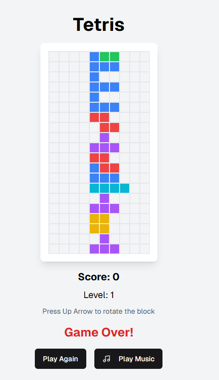

# 🎮 Tetris

A modern, responsive Tetris game built with React, Next.js, and Tailwind CSS.



## 🚀 Features

- Classic Tetris gameplay
- Responsive design
- Keyboard controls (arrow keys to move, up to rotate)
- Score and level tracking
- Animated block drops and line clears
- Play/pause background music
- Clean, modern UI

## 🕹️ Controls

- **Left/Right Arrow:** Move block left/right
- **Down Arrow:** Move block down faster
- **Up Arrow:** Rotate block
- **Reset Game:** Start a new game
- **Play Music:** Toggle background music

## 📸 Screenshot


## 🛠️ Tech Stack

- [React](https://react.dev/)
- [Next.js](https://nextjs.org/)
- [Tailwind CSS](https://tailwindcss.com/)
- [Framer Motion](https://www.framer.com/motion/) (for animations)
- [Lucide Icons](https://lucide.dev/)

## 📦 Getting Started

1. **Clone the repository:**
   ```sh
   git clone https://github.com/YOUR-USERNAME/tetris.git
   cd tetris
   ```

2. **Install dependencies:**
   ```sh
   npm install
   ```

3. **Run the development server:**
   ```sh
   npm run dev
   ```

4. Open [http://localhost:3000](http://localhost:3000) in your browser.

## 📄 License

MIT

---

> Made with ❤️ for fun and learning! 